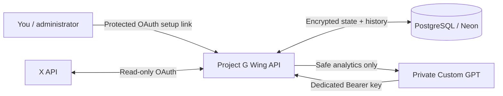
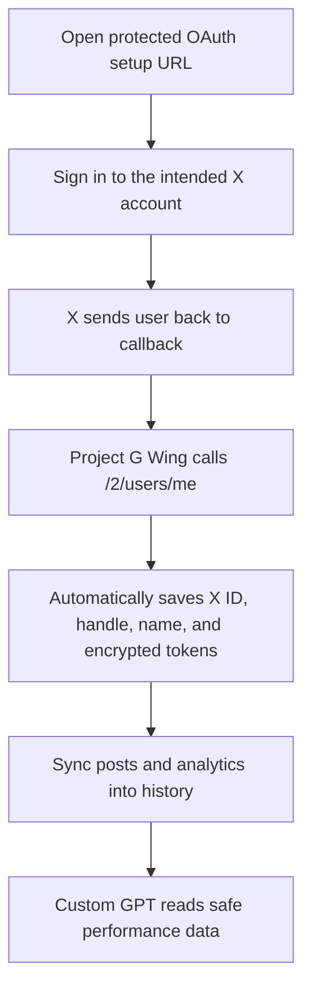

# Project G Wing | X ACCOUNT ANALYST GROWTH SYSTEM

**A private, read-only X analytics service that gives ChatGPT the context to understand what is working, what is not, and what to post next.**

Project G Wing connects one or more X accounts, keeps their analytics history in PostgreSQL, and exposes a small, safe API for people, automations, and Custom GPTs. It never publishes to X and it never returns X credentials.

> The happy path: connect an X account once → collect history automatically → ask your Custom GPT what to improve → receive two stronger post ideas every day.

## What you can do with it

- Connect multiple X accounts without manually entering account IDs.
- Preserve account and post performance history across Render redeploys.
- Compare today vs. yesterday, 7 days vs. the prior 7, and 30 days vs. the prior 30.
- See posts, full text, format, media, links, hashtags, engagement, impressions, clicks, and derived rates when X provides them.
- Ask a Custom GPT for data-backed content recommendations without handing it X OAuth credentials.
- Add future accounts by completing OAuth again — no new integration or database design required.

## The big picture



One X developer app is shared. Each X account has its **own** encrypted user authorization, so BloomQuest data can never be mixed with SerionFlow data.



## Start here

Choose the path that fits you:

| I want to…                               | Start with                                                            |
| ---------------------------------------- | --------------------------------------------------------------------- |
| Run this project myself                  | [Deploy your own copy](#deploy-your-own-copy)                         |
| Connect my first X account               | [Connect X accounts](#connect-x-accounts)                             |
| Give a Custom GPT safe access            | [Set up a Custom GPT Action](#set-up-a-custom-gpt-action-recommended) |
| Inspect every endpoint in a browser      | `https://YOUR_API_DOMAIN/docs`                                        |
| Use the hosted Project G Wing deployment | [Live API documentation](https://apx.serionflow.com/docs)             |

## What is safe to share?

| Share with                        | Safe to share                                                          | Never share                                                  |
| --------------------------------- | ---------------------------------------------------------------------- | ------------------------------------------------------------ |
| Custom GPT                        | Its dedicated `CHATGPT_ACTION_API_KEY`, entered in the GPT editor only | X client secret, X OAuth tokens, database URL, admin API key |
| Your browser during account setup | The protected OAuth setup link                                         | The raw `OAUTH_SETUP_TOKEN` in public posts or screenshots   |
| Admin tools / Swagger             | Your admin API key in an Authorization header                          | API key hashes, encryption key, X token set                  |
| GitHub                            | `.env.example` only                                                    | `.env`, Render environment values, Neon connection strings   |

The service encrypts account credentials with AES-256-GCM, redacts sensitive request fields from logs, and returns sanitized analytics only.

## Deploy your own copy

### What you need

1. A [Render](https://render.com/) account for hosting.
2. A free [Neon](https://neon.com/) PostgreSQL database for durable storage.
3. An X developer app with OAuth 2.0 enabled.
4. A domain is optional, but recommended for a cleaner Custom GPT Action URL.

### 1. Create the Render service

This repository includes [`render.yaml`](render.yaml). In Render:

1. Choose **New → Blueprint**.
2. Select this GitHub repository.
3. Render detects the Blueprint and creates a Node web service.
4. Use the default build command: `npm ci && npm run build`.
5. Use the default start command: `npm start`.

Render supplies `PORT` automatically. Do not add your own `PORT` variable.

### 2. Create durable storage in Neon

1. Create a project in [Neon](https://console.neon.tech/).
2. Open **Connect** and choose the **Pooled** connection string.
3. Copy the complete PostgreSQL URL.
4. In Render → your service → **Environment**, add it as `DATABASE_URL`.

The database stores encrypted connection details plus account snapshots, posts, and metric snapshots. It is what keeps your history when a free Render service restarts.

### 3. Add environment variables in Render

In Render → your service → **Environment**, add the following. Keep all secret values private.

| Variable                    | What to enter                                         | Required for                        |
| --------------------------- | ----------------------------------------------------- | ----------------------------------- |
| `API_KEY_HASHES`            | Hash printed by `npm run keygen`                      | Admin API and Swagger               |
| `CHATGPT_ACCESS_TOKEN`      | A 32+ character random URL-safe token                 | Legacy URL-token endpoint           |
| `CREDENTIAL_ENCRYPTION_KEY` | Output of `openssl rand -base64 48`                   | Encrypting X tokens at rest         |
| `DATABASE_URL`              | Neon **pooled** PostgreSQL connection string          | Durable history                     |
| `X_CLIENT_ID`               | X developer app client ID                             | X OAuth                             |
| `X_CLIENT_SECRET`           | X app client secret for confidential apps             | X OAuth, if supplied by X           |
| `OAUTH_SETUP_TOKEN`         | A separate 32+ character random URL-safe token        | Starting account OAuth in a browser |
| `X_OAUTH_REDIRECT_URI`      | Your exact callback URL, ending in `/auth/x/callback` | X OAuth                             |

For a Custom GPT Action, also add:

| Variable                  | Example                                 | Purpose                                    |
| ------------------------- | --------------------------------------- | ------------------------------------------ |
| `CHATGPT_ACTION_API_KEY`  | A new 32+ character random value        | The GPT's narrow, read-only key            |
| `PUBLIC_API_BASE_URL`     | `https://api.example.com`               | Your verified public API domain            |
| `CHATGPT_ACTION_ACCOUNTS` | `brand=brand_handle,personal=my_handle` | Friendly action URLs for selected accounts |

Generate secrets with these commands:

```bash
# Admin API key and its server-side hash
npm run keygen

# Each of these should be generated separately
node -e "console.log(require('crypto').randomBytes(32).toString('base64url'))"
openssl rand -base64 48
```

Use the raw API key from `npm run keygen` only as an administrator. Put the printed hash in `API_KEY_HASHES`.

### 4. Configure your X developer app

In the [X Developer Portal](https://developer.x.com/), configure one OAuth 2.0 **Web App, Automated App or Bot** application.

Use your real public API domain consistently:

| X setting               | Example                                   |
| ----------------------- | ----------------------------------------- |
| Website URL             | `https://api.example.com`                 |
| Callback / Redirect URI | `https://api.example.com/auth/x/callback` |
| OAuth scopes            | `tweet.read users.read offline.access`    |

Copy that exact callback URI into `X_OAUTH_REDIRECT_URI` in Render. Even a small mismatch causes X OAuth to fail.

`offline.access` lets the service refresh account access safely. The service rejects write scopes, so it cannot post, follow, delete, or change anything on X.

Helpful references: [X OAuth 2.0 authorization code flow](https://docs.x.com/fundamentals/authentication/oauth-2-0/authorization-code), [Render custom domains](https://render.com/docs/custom-domains), and [Neon connection strings](https://neon.com/docs/connect/connect-from-any-app).

## Connect X accounts

After Render has deployed, open this address in a browser while signed in to the X account you want to connect:

```text
https://YOUR_API_DOMAIN/auth/x/YOUR_OAUTH_SETUP_TOKEN
```

For example, a service hosted at `https://api.example.com` uses:

```text
https://api.example.com/auth/x/YOUR_OAUTH_SETUP_TOKEN
```

Approve the X prompt. Project G Wing then automatically discovers the account with X’s authenticated-user endpoint and stores:

- immutable X account ID
- handle and display name
- profile image, when supplied by X
- encrypted access and refresh token references
- connection health and last successful sync

Repeat the same process while signed into your second, third, or fourth X account. You do **not** type an account ID manually.

### Confirm a connection

Open your API docs:

```text
https://YOUR_API_DOMAIN/docs
```

Run `GET /v1/connections`, click **Authorize**, and enter your admin API key as:

```text
Bearer YOUR_ADMIN_API_KEY
```

You should see safe account information such as the X account ID, handle, status, and last sync time — never tokens or secrets.

## Set up a Custom GPT Action (recommended)

The Action is the cleanest way to let ChatGPT analyze your data. The GPT receives a dedicated Bearer key and can call only the selected, read-only account routes. It does not receive account IDs, URL tokens, X credentials, or admin access.

### Choose friendly account names

Set `CHATGPT_ACTION_ACCOUNTS` in Render. The format is:

```text
friendly-name=x-handle-or-account-id,another-name=another-handle
```

Example:

```text
brand=brand_handle,founder=founder_handle
```

This creates these Action endpoints after deployment:

```text
GET /actions/x/brand?days=30
GET /actions/x/founder?days=30
```

If you leave this variable empty, the starter mapping remains:

```text
bloomquest=bloomquestapp,serionflow=SerionFlow
```

### Create the GPT

1. Go to [the GPT editor](https://chatgpt.com/gpts/editor) and choose **Create**.
2. Open **Configure** and scroll to **Actions**.
3. Choose **Create new action** → **Import from URL**.
4. Paste:

   ```text
   https://YOUR_API_DOMAIN/actions/openapi.json
   ```

5. Click the Authentication gear, choose **API key → Bearer**, and enter the exact `CHATGPT_ACTION_API_KEY` value from Render.
6. Test each detected action in the Preview panel.
7. Keep the GPT private while testing, then click **Create**.

Use a supported non-Pro model mode for Actions. See [OpenAI’s Action setup guide](https://help.openai.com/en/articles/9442513) for the current GPT editor details.

### Suggested GPT instructions

Paste this into your Custom GPT’s **Instructions** field:

```text
You are an X growth analyst.

Before making performance claims or writing recommendations, call the relevant analytics action.

For each requested account:
- Analyze recent posts, engagement, impressions, formats, hooks, topics, CTAs, links, posting times, and follower movement.
- Clearly separate data-backed facts from recommendations.
- Identify what worked, what underperformed, and the evidence for each conclusion.
- Recommend exactly two stronger posts, ready to publish on X.
- Briefly explain why each proposed post should perform better.
- Never invent metrics, results, or trends that are absent from the API response.
```

Try this first prompt:

```text
Analyze the last 30 days for every connected account. What is working, what is underperforming, and what two posts should each account publish today?
```

## API guide

Your interactive API reference lives at:

```text
https://YOUR_API_DOMAIN/docs
```

The machine-readable OpenAPI document is at:

```text
https://YOUR_API_DOMAIN/openapi.json
```

### Main routes

| Route                                        | Who uses it        | What it does                                |
| -------------------------------------------- | ------------------ | ------------------------------------------- |
| `GET /healthz`                               | Render             | Simple liveness check                       |
| `GET /docs`                                  | You                | Interactive API documentation               |
| `GET /v1/connections`                        | Admin              | List safe connection identity and health    |
| `GET /v1/analytics/{account}?days=30`        | Admin              | Account history and follower growth         |
| `GET /v1/posts/{account}?days=30`            | Admin              | Post text, metadata, metrics, and rates     |
| `GET /v1/posts/{account}/{post_id}`          | Admin              | One post with age-based metric history      |
| `GET /v1/summary/{account}?days=7`           | Admin              | Period comparisons and content performance  |
| `GET /actions/openapi.json`                  | Custom GPT editor  | Importable Action schema                    |
| `GET /actions/x/{friendly-name}?days=30`     | Custom GPT         | Safe analytics for one allow-listed account |
| `GET /api/chatgpt/{token}/{account}?days=30` | Legacy integration | Safe URL-token analytics endpoint           |

Admin `/v1` routes require `Authorization: Bearer YOUR_ADMIN_API_KEY`. Action routes require the separate Action key. Both are rate-limited.

### What the analytics response includes

For each account, the safe API can include:

- account ID, handle, display name, followers, following, total posts, and snapshot time
- post ID, complete text, creation time, canonical URL, reply/quote/repost flags, media type, URLs, hashtags, mentions, and language
- impressions, likes, replies, reposts, quotes, bookmarks, profile clicks, URL clicks, and total engagements when X supplies them
- engagement, like, reply, repost, click-through, and profile-visit rates
- account history, follower growth, best/worst posts, average performance, format performance, and hashtag/topic performance
- an initial post metric plus the first available metrics at 1 hour, 6 hours, 24 hours, 3 days, 7 days, and 30 days after publishing

`null` means X did not provide that metric. It does not mean zero.

## Run locally

```bash
git clone <YOUR_FORK_URL>
cd project-g-wing
npm install
cp .env.example .env
```

Fill in `.env` using the comments in [`.env.example`](.env.example), then run:

```bash
npm run dev
```

Open <http://localhost:3000/docs> to explore the API. Before a production deployment, run:

```bash
npm run typecheck
npm test
npm run build
```

## Add more accounts later

No data model change is needed.

1. Complete the OAuth setup link while signed into the new X account.
2. Confirm it appears in `GET /v1/connections`.
3. If the Custom GPT should access it, add a new `friendly-name=handle` pair to `CHATGPT_ACTION_ACCOUNTS` and redeploy.
4. Re-import `GET /actions/openapi.json` in the GPT editor so it sees the additional action.

## Troubleshooting

| You see…                             | Usually means                                                                      | What to do                                                                                                          |
| ------------------------------------ | ---------------------------------------------------------------------------------- | ------------------------------------------------------------------------------------------------------------------- |
| `token_refresh_failed`               | X rejected an expired or revoked refresh token                                     | Run the protected OAuth setup link again while signed into that account. Reconnecting preserves history.            |
| `credits depleted` or X `402`        | Your X developer app’s available credits are exhausted                             | Add X API credits or wait for the applicable allowance. Credits are tied to the developer app, not each connection. |
| `unauthorized` in `/docs`            | The Authorization header is missing or uses the wrong key                          | Enter `Bearer ` followed by your raw admin API key.                                                                 |
| GPT Action cannot import             | The app is not deployed yet, the domain is wrong, or the schema URL is unreachable | Open `/actions/openapi.json` in a browser first; it should return JSON.                                             |
| GPT Action returns `401`             | The Action key in GPT does not match `CHATGPT_ACTION_API_KEY` in Render            | Update the key in the GPT Action Authentication settings.                                                           |
| OAuth says callback mismatch         | The callback in X and `X_OAUTH_REDIRECT_URI` differ                                | Copy the exact same HTTPS callback URI into both places.                                                            |
| Connections disappear after a deploy | Durable storage is not configured                                                  | Set `DATABASE_URL` to a Neon pooled connection, then reconnect accounts once.                                       |

## Security checklist

- [ ] Use separate values for admin API access, OAuth setup, legacy URL access, and the Custom GPT Action key.
- [ ] Keep `DATABASE_URL`, `CREDENTIAL_ENCRYPTION_KEY`, X client secret, and X OAuth tokens out of GitHub and chat messages.
- [ ] Use a private Custom GPT while testing.
- [ ] Rotate a key immediately if it appears in a screenshot, browser URL, message, or commit.
- [ ] Keep `X_OAUTH_SCOPES` read-only: `tweet.read users.read offline.access`.
- [ ] Use a custom domain and HTTPS for production.

## Project layout

```text
src/
  auth/          API-key verification and HTTPS guards
  config/        Environment validation and account configuration
  routes/        Health, admin, OAuth, legacy ChatGPT, and Custom GPT Action routes
  security/      AES-256-GCM credential vault
  services/      Account connection, sync, history, summaries, and analytics
  storage/       PostgreSQL JSONB or local-file persistence
  x/             Read-only X API v2 client and metric helpers
tests/           Unit and end-to-end tests
```

## Useful links

- [Interactive API docs](https://apx.serionflow.com/docs)
- [Live Custom GPT Action schema](https://apx.serionflow.com/actions/openapi.json)
- [X OAuth 2.0 documentation](https://docs.x.com/fundamentals/authentication/oauth-2-0/authorization-code)
- [Render documentation](https://render.com/docs)
- [Neon documentation](https://neon.com/docs)
- [OpenAI Custom GPT Actions guide](https://help.openai.com/en/articles/9442513)

---

Built for learning from real performance over time — not guessing what might work.
